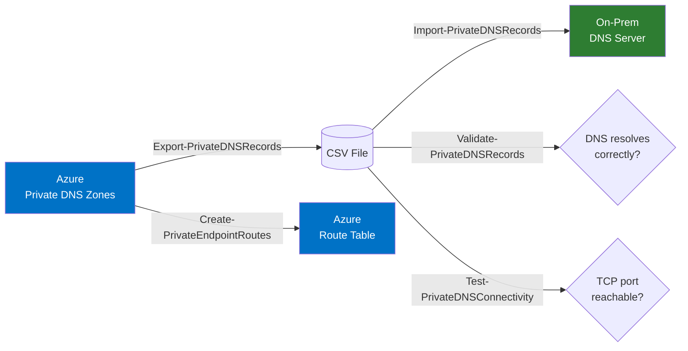
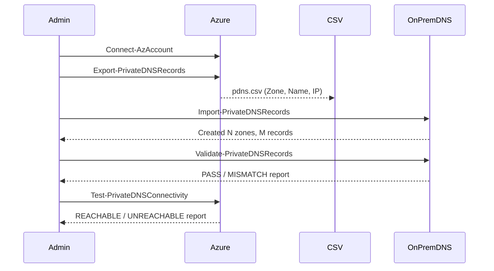

# azure-private-dns

PowerShell toolkit for bridging Azure Private DNS zones to on-premises DNS infrastructure, and for keeping route tables in sync with private endpoints.

## Overview

When Azure Private Endpoints are used in a hybrid network, on-premises clients need matching A records in their local DNS to resolve private link addresses. This toolkit automates the export, import, validation, and connectivity testing of those records — and optionally keeps an Azure Route Table up to date with /32 host routes for each endpoint.



## Prerequisites

- PowerShell 7+
- `Az.Accounts`, `Az.PrivateDns`, `Az.Network` modules (for Azure scripts):
  ```powershell
  Install-Module Az -Scope CurrentUser
  ```
- `DnsServer` RSAT module (for `Import-PrivateDNSRecords.ps1`, Windows only):
  ```powershell
  Add-WindowsCapability -Online -Name Rsat.Dns.Tools~~~~0.0.1.0
  ```
- An active Azure context before running any Az scripts:
  ```powershell
  Connect-AzAccount
  ```

## Scripts

### Export-PrivateDNSRecords.ps1

Exports all Private DNS A records from an Azure subscription to a CSV file.

```powershell
.\scripts\Export-PrivateDNSRecords.ps1 `
    -SubscriptionId '00000000-0000-0000-0000-000000000000' `
    -CsvPath 'C:\temp\pdns.csv'
```

| Parameter | Required | Description |
|---|---|---|
| `SubscriptionId` | Yes | Azure subscription ID containing the Private DNS zones |
| `CsvPath` | Yes | Output CSV file path |
| `Force` | No | Overwrite the CSV if it already exists |

**Output CSV columns:** `Zone`, `Name`, `Value` (IP address)

---

### Import-PrivateDNSRecords.ps1

Reads the exported CSV and creates the corresponding Forward Lookup Zones and A records on a Windows DNS server. Idempotent — skips zones and records that already exist.

```powershell
.\scripts\Import-PrivateDNSRecords.ps1 `
    -DnsServerName 'dns01' `
    -CsvPath 'C:\temp\pdns.csv'
```

| Parameter | Required | Description |
|---|---|---|
| `DnsServerName` | Yes | Hostname or IP of the Windows DNS server |
| `CsvPath` | Yes | Path to the CSV produced by the export script |

Supports `-WhatIf` to preview changes without applying them.

---

### Validate-PrivateDNSRecords.ps1

Checks that each record in the CSV resolves to its expected IP address. Strips the `privatelink.` prefix to construct the public FQDN used for resolution.

```powershell
# Validate using system resolver
.\scripts\Validate-PrivateDNSRecords.ps1 -CsvPath 'C:\temp\pdns.csv'

# Validate via a specific DNS server
.\scripts\Validate-PrivateDNSRecords.ps1 -CsvPath 'C:\temp\pdns.csv' -DnsServer '10.0.0.4'
```

| Parameter | Required | Description |
|---|---|---|
| `CsvPath` | Yes | Path to the CSV |
| `DnsServer` | No | DNS server IP to query (defaults to system resolver) |

**Status values:** `PASS` · `MISMATCH` (resolves, but wrong IP) · `NO_A_RECORD` · `FAIL`

---

### Test-PrivateDNSConnectivity.ps1

Tests TCP connectivity to each endpoint's IP on a given port. Use after import to confirm network routing and firewall rules allow traffic.

```powershell
# Test HTTPS (default port 443)
.\scripts\Test-PrivateDNSConnectivity.ps1 -CsvPath 'C:\temp\pdns.csv'

# Test SQL (port 1433) with extended timeout
.\scripts\Test-PrivateDNSConnectivity.ps1 -CsvPath 'C:\temp\pdns.csv' -Port 1433 -TimeoutMs 5000
```

| Parameter | Required | Description |
|---|---|---|
| `CsvPath` | Yes | Path to the CSV |
| `Port` | No | TCP port to test (default: 443) |
| `TimeoutMs` | No | Connection timeout in ms (default: 2000) |

**Status values:** `REACHABLE` · `UNREACHABLE`

---

### Create-PrivateEndpointRoutes.ps1

Enumerates all Private DNS A records and creates a corresponding /32 host route in an Azure Route Table for each endpoint, directing traffic to a next-hop IP (firewall or NVA). Idempotent — skips routes that already exist.

Intended to run on a schedule (e.g. daily Azure Automation runbook) to keep the Route Table current as new endpoints are provisioned.

```powershell
.\scripts\Create-PrivateEndpointRoutes.ps1 `
    -SubscriptionId '00000000-0000-0000-0000-000000000000' `
    -RouteTableResourceGroupName 'rg-networking' `
    -RouteTableName 'rt-hub' `
    -NextHopIpAddress '10.0.0.4'
```

| Parameter | Required | Description |
|---|---|---|
| `SubscriptionId` | Yes | Azure subscription to enumerate endpoints from |
| `RouteTableResourceGroupName` | Yes | Resource group of the Route Table |
| `RouteTableName` | Yes | Name of the Route Table to update |
| `NextHopIpAddress` | Yes | Next-hop IP (firewall or NVA) |

Supports `-WhatIf` to preview changes without applying them.

## Typical workflow



## CI

Pull requests are linted with [PSScriptAnalyzer](https://github.com/PowerShell/PSScriptAnalyzer) via GitHub Actions — see `.github/workflows/lint.yml`.
